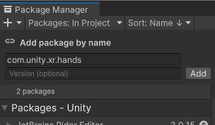
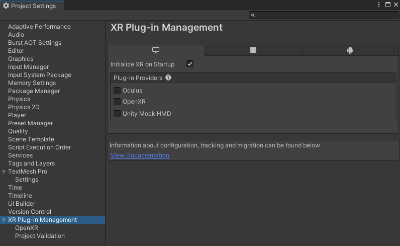

# Install XR Hands

XR Hands is an official Unity package available via the [Package Manager](https://learn.unity.com/tutorial/the-package-manager).

To install this package in Unity 2021.2+:

1. Open the project that you plan to use.
2. Click the following link: [com.unity.xr.hands](com.unity3d.kharma:upmpackage/com.unity.xr.hands).

   The Unity Package Manager window opens with the package name entered in the **Add package by name** dialog.

   

3. (Optional) Enter the full version number, such as `1.2.0`, to install. If left blank, Unity chooses the "best" version -- typically the latest, release version for the current Unity Editor.  See the [Changelog](xref:xrhands-changelog) for a list of versions available at the time this documentation page was published.
4. Click **Add**.

To install the XR Hands package to a project in earlier versions of Unity, see [Edit the manifest](xref:xrhands-edit-your-project-manifest).

| Additional resources | Description | 
| :------------------- | :---------- |
| [The Package Manager tutorial](https://learn.unity.com/tutorial/the-package-manager#) | An overview of installing and managing packages in Unity. |
| [Package Manager](xref:upm-ui) | Detailed documentation about the Package Manager in the Unity Manual. |
| [Package states and lifecycle](xref:upm-lifecycle) | About the package lifecycle and version numbers. |

## Editor compatibility

XR Hands 1.2 is compatible with Unity 2021.3 and later.

> [!NOTE]
> XR Hands 1.2 is compatible with Unity 2021.3 and up, but it does not appear in the Package Manager window before 2023.1. 

# Required packages

The XR Hands package contains base classes and utility for hand-tracking, but doesn't implement the feature itself. To use XR Hands, you also need a separate *provider plug-in* package that defines a hand provider. A provider plug-in is a separate package containing XR feature implementations for a given platform.

To see if the provider plug-in package you use supports hand tracking, check the documentation for that package.

To use XR Hands on a device, you must install at least one provider plug-in, either from the Package Manager or by going to **Project Settings** > **XR Plug-in Management** as shown below.

 *XR Plug-in Management*
